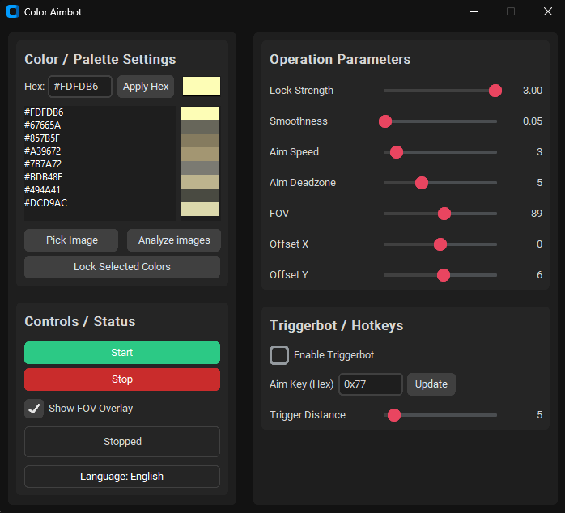

# Phantom Force Aimbot (Color Tracking)

ภาษาไทย (TH) | English (EN)

---

## ภาษาไทย (TH)

ภาพรวมของโปรแกรมที่ช่วยเล็งโดยอิงจากสีเป้าหมายบนหน้าจอ ใช้ OpenCV + MSS จับภาพบริเวณกลางจอ แล้วสร้างมาสก์สีเพื่อหาเป้าหมาย จากนั้นขยับเมาส์อย่างนุ่มนวลด้วยตัวกรองและการปรับพารามิเตอร์แบบไดนามิก

### ฟีเจอร์หลัก
- ปรับ UI ใหม่ให้เรียบง่ายและสมดุล พร้อมสลับภาษา Eng/TH
- ปุ่มเริ่มทำงานทันที (ไม่ต้องยืนยัน)
- FOV เริ่มต้นไม่ถูกติ๊ก สามารถเปิด/ปิดได้จาก UI
- วิเคราะห์สีจากโฟลเดอร์ `images` เพื่อดึงสีที่พบบ่อยมาใช้ล็อคเป้าอัตโนมัติ
- คลิกสองครั้งที่รายการสีเพื่อ Apply สีทันทีในช่อง Hex
- คะแนนความเชื่อมั่นรวม (สีตรง + ความแน่นรูปร่าง + ความใกล้ crosshair)
- Kalman filter ทำนายตำแหน่ง เพิ่มความนิ่ง
- Gate หลายเฟรมก่อนขยับเมาส์ ลดล็อคผิดเป้า
- ปรับ `FOV` และ `Deadzone` แบบไดนามิกตามความเชื่อมั่น
- หน้าต่างพรีวิวมาสก์แบบเรียลไทม์
- เรียนรู้สีอัตโนมัติระหว่างใช้งาน

### วิธีใช้งาน
1. ติดตั้ง Python 3.9+: `opencv-python`, `numpy`, `mss`, `pywin32`
2. รันโปรแกรม: `python main.py`
3. ไปที่แท็บสี กด “วิเคราะห์ images” และดับเบิลคลิกสีเพื่อ Apply
4. ปรับ Lock, Smooth, Max step, Deadzone, FOV ในแท็บพารามิเตอร์
5. กรอบควบคุม: เริ่ม, แสดง FOV, พรีวิวมาสก์, ปรับช่วงสีอัตโนมัติ, FOV/Deadzone ไดนามิก

### ปุ่มและคีย์ลัด
- Toggle aim: `F7`
- ขยับเมื่อกดเมาส์ขวา

### แนวทางปรับให้แม่นขึ้น
- เพิ่ม `Smooth` ให้นุ่มขึ้น, ลด `Deadzone` ให้ไวขึ้น
- ใช้ “วิเคราะห์ images” และเปิด “ปรับช่วงสีอัตโนมัติ” เพื่อให้ระบบปรับตามฉากจริง

### ข้อกำหนด
- Windows เท่านั้น; จอแนะนำ Full HD หรือปรับใน `Config`

---

## English (EN)

Overview: color-based aiming assistant using OpenCV + MSS. It captures a centered screen region, builds a color mask to locate targets, then moves the mouse smoothly with filters and dynamic parameter adjustments.

### Key Features
- Clean, balanced UI with language toggle (EN/TH)
- Instant start button (no confirmation dialog)
- FOV unchecked by default, toggleable in UI
- Image folder analysis to auto-pick dominant colors for locking
- Double-click palette items to apply Hex instantly
- Confidence scoring (color match + solidity + proximity)
- Kalman filter prediction for steadier motion
- Multi-frame gate before mouse movement
- Dynamic `FOV` and `Deadzone` based on confidence
- Real-time mask preview window
- Online auto color learning while in use

### Usage
1. Install Python 3.9+: `opencv-python`, `numpy`, `mss`, `pywin32`
2. Run: `python main.py`
3. Color tab: click “Analyze images” then double-click a color to apply
4. Tune Lock, Smooth, Max step, Deadzone, FOV in Parameters tab
5. Controls: Start, Show FOV, Mask Preview, Auto Color Learn, Dynamic FOV/Deadzone

### Keys
- Toggle aim: `F7`
- Aiming when holding right mouse button

### Tuning Tips
- Increase `Smooth` for softer motion; reduce `Deadzone` for faster response
- Use image analysis and enable auto color learning for in-game adaptation

### Requirements
- Windows only; Full HD screen recommended or adjust capture size in `Config`
